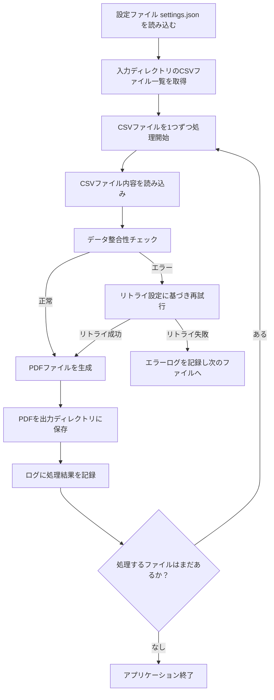

# 設計書

## 概要

### 背景・目的

背景：CSVデータの手動処理に時間と手間がかかっている。

目的：CSVファイルの検証・変換・PDF出力を自動化し、業務効率を向上させる。

### 機能一覧

* このプログラムは、指定された入力ディレクトリからCSVファイルを読み込み、設定ファイルの内容に基づいて処理を行います。
* 処理中にネットワーク接続が必要な場合は、接続失敗時にリトライ機能を用いて再試行します。
* 最終的に処理結果をPDF形式で出力し、ログファイルに実行状況を記録します。

## 入力

### ファイル（JSON用テンプレート）

| 項目 | 内容 |
| ---- | ---- |
| ファイル名 | `settings.json` |
| 配置場所 | 任意 |
| 形式 | JSON |
| エンコーディング | UTF-8(BOM付き可) |
| 内容概要 | 設定ファイル |

| キー名 | データ型 | 説明 | 例 |
| ---- | ---- | ---- | ---- |
| input_dir | string | 入力ファイルのディレクトリパス | "data/input" |
| output_dir | string | 出力ファイルのディレクトリパス | "data/output" |
| retry_policy.enabled | boolean | リトライ機能を有効にするかどうか | true |
| retry_policy.max_retries | int | 最大リトライ回数 | 3 |
| retry_policy.interval | int | リトライ間隔（秒） | 5 |

```json
{
  "input_dir": "data/input",
  "output_dir": "data/output",
  "retry_policy": {
    "enabled": true,
    "max_retries": 3,
    "interval": 5
  }
}

### ファイル（CSV用テンプレート）

| 項目 | 内容 |
| ---- | ---- |
| ファイル名 | `input_data.csv` |
| 形式 | CSV |
| エンコーディング | UTF-8(BOM付き可) |
| ヘッダー | あり  |
| 区切り文字    | `,` |
| 内容概要 | 入力ファイル |

| 列名 | データ型 | 説明 |
| ---- | ---- | ---- |
| id | int | ユーザーID |
| name | str | ユーザー名 |
| email | str | メールアドレス |
| created_at | datetime | 作成日時 |

```csv
id,name,email,created_at
1,Alice,alice@example.com,2025-06-01T12:00:00
2,Bob,bob@example.com,2025-06-02T08:30:00
```

## 出力

### ログファイル

* 「ログ出力」の章に記載する。

### ファイル（PDF用テンプレート）

| 項目 | 内容 |
| ---- | ---- |
| ファイル名 | `output_data.pdf` |
| 形式 | PDF |
| 内容概要 | 出力ファイル |

## 実行方法

```bash
python main.py
```

## 想定実行環境

| 項目 | 内容 |
| ---- | ---- |
| CPU | Intel 第10世代 Core i5 以上相当 |
| メモリー | 8 GB 以上 |
| OS | Windows 10 / Windows 11 |
| Python | 3.x 以降 |
| Pythonライブラリー | pandas==1.5.3 <br/> requests==2.31.0 |

## 処理詳細

1. 設定ファイル `settings.json` を読み込む。
1. 入力ディレクトリに存在するCSVファイルのリストを取得する。
1. 取得したCSVファイルを1つずつ処理開始。
1. 各CSVファイルの内容を読み込み、データを検証する。
1. 処理中にエラーが発生した場合、リトライ設定に基づき再試行する。
1. 正常に処理が完了したデータをもとにPDFファイルを生成する。
1. 生成したPDFを指定された出力ディレクトリに保存する。



## ログ出力

### ログ出力概要

| 項目 | 内容 |
| ---- | ---- |
| 出力先 | logs/app_yyyyMMdd.log |
| ログレベル | INFO / ERROR |
| フォーマット | `yyyy-MM-dd HH:mm:ss [LEVEL] message` |

### ログ出力例

```text
2025-06-07 14:23:01 [INFO] アプリケーションを開始しました
2025-06-07 14:23:01 [INFO] 設定ファイルを読み込みました: settings.json
2025-06-07 14:23:01 [INFO] 入力ディレクトリ: data/input
2025-06-07 14:23:01 [INFO] 出力ディレクトリ: data/output
2025-06-07 14:23:01 [INFO] リトライ設定: 有効（最大3回、5秒間隔）
2025-06-07 14:23:02 [INFO] ファイルの処理を開始: input_001.csv
2025-06-07 14:23:03 [ERROR] 処理中にエラーが発生しました: 接続タイムアウト
2025-06-07 14:23:03 [INFO] リトライ 1回目（5秒後に再試行）
2025-06-07 14:23:08 [INFO] リトライ成功: input_001.csv を再処理中
2025-06-07 14:23:09 [INFO] 処理完了: input_001.csv（出力: output_001.csv）
2025-06-07 14:23:10 [INFO] 全ファイルの処理が完了しました
2025-06-07 14:23:10 [INFO] アプリケーションを終了します
```

### ログメッセージ

| No. | レベル | テンプレート |
| ---- | ---- | ---- |
| 1 | INFO | アプリケーションを開始しました |
| 2 | INFO | 設定ファイルを読み込みました: `{file_name}` |
| 3 | INFO | 入力ディレクトリ: `{input_dir}` |
| 4 | INFO | 出力ディレクトリ: `{output_dir}` |
| 5 | INFO | リトライ設定: `{enabled_display}（最大{max_retries}回、{interval}秒間隔）` |
| 6 | INFO | ファイルの処理を開始: `{file_name}` |
| 7 | ERROR | 処理中にエラーが発生しました: `{error_message}` |
| 8 | INFO | リトライ `{retry_count}`回目（{interval}秒後に再試行） |
| 9 | INFO | リトライ成功: `{file_name}` を再処理中 |
| 10 | INFO | 処理完了: `{input_file}`（出力: `{output_file}`） |
| 11 | INFO | 全ファイルの処理が完了しました |
| 12 | INFO | アプリケーションを終了します |

## ライセンス

### 本プログラムのライセンス

* このプログラムはMITライセンスに基づいて提供されます。

### 使用ライブラリーのライセンス

| ライブラリ名 | バージョン | ライセンス |
| ---- | ---- | ---- |
| pandas | 1.5.3 | BSD 3-Clause |
| requests | 2.31.0 | Apache License 2.0 |
| fpdf | 1.7.2 | LGPLv3 |

## 開発詳細

### 開発環境

* VSCode バージョン 1.100.3
* Python 3.11.4

### 検証環境

| 項目 | 内容 |
| ---- | ---- |
| CPU | Intel64 Family 6 Model 154 Stepping 3 |
| メモリー | 16 GB |
| OS | Windows 11 |
| Python | 3.11.4 |
| Pythonライブラリー | pandas==1.5.3 <br/> requests==2.31.0 |

## 改訂履歴

* テンプレートの改訂履歴を示しています。このテンプレートを使用する際は、ツールの改訂履歴に置き換えてください。

| バージョン | 日付 | 内容 |
| ----- | ---------- | -------------- |
| 1.1.1 | 2025-06-08 | 内容を改訂。<ul><li>概要に「背景・目的」と「機能一覧」を追加。</li><li>ライセンス情報に使用ライブラリとそのライセンスを明記。</li><li>「開発詳細」セクションを新設（開発環境と検証環境を分離）。</li><li>全体の見出し構成を調整し、情報の分類を明確化。</li><li>Markdown表記とコードブロックの体裁を微修正</li></ul>|
| 1.1.0 | 2025-06-07 | 内容を大幅改訂。<ul><li>想定実行環境・検証環境を表形式に変更し、項目ごとに明確化（CPU・メモリー・OSなど）。</li><li>ログ出力の章を細分化。</li><li>ログの出力ファイル名形式を動的に変更（例：app_yyyyMMdd.log）。</li><li>ログメッセージを一覧化し、連番とプレースホルダー付きでテンプレート化。</li><li>CPU情報の表現を「推奨スペック」形式へ変更。</li><li>細かな体裁調整や見出し・区切り強化（見出し構造、表のラベル整備など）。</li></ul> |
| 1.0.0 | 2025-04-06 | 初版リリース |
