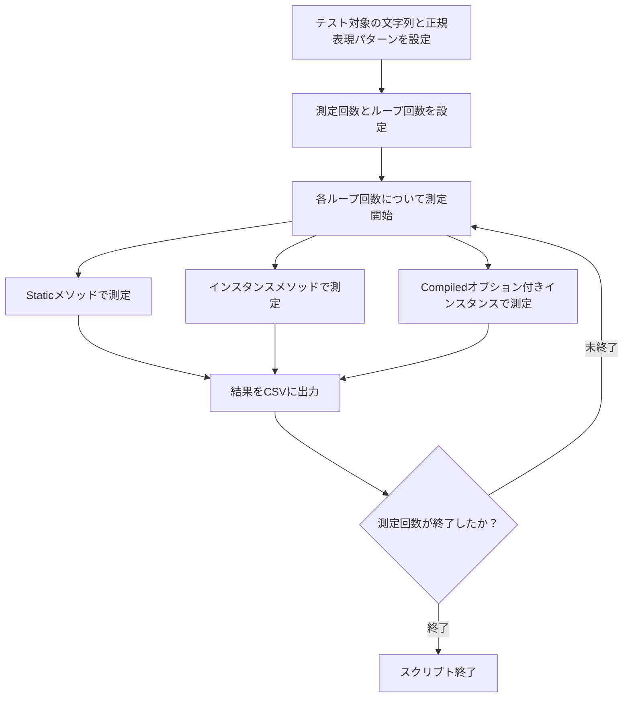

# 設計書

## 概要

### 背景・目的

異なる正規表現の実行方法（Staticメソッド、インスタンスメソッド、Compiledオプション付きインスタンス）に対して、正規表現のマッチングのパフォーマンスを測定する。

### 機能一覧

* このスクリプトは、指定された正規表現パターンを用いて、異なる実行方法のパフォーマンスを測定します。
* 測定結果はCSV形式で出力されます。
* 測定は複数回繰り返し実行され、ループ回数ごとの結果を記録します。

## 入力

### スクリプト内パラメーター

| 項目 | 内容 |
| ---- | ---- |
| `$string` | テスト対象の文字列 |
| `$pattern` | 正規表現パターン |
| `$loopCounts` | ループ回数の配列(正の整数の配列) |
| `$measurementCount` | 測定回数(正の整数) |

### サンプル

```powershell
$string = "The quick brown fox jumps over the lazy dog 1234567890" * 10
$pattern = '\d{10}'
$loopCounts = @(10, 100, 1000, 10000)
$measurementCount = 100
```

## 出力

### ファイル（CSV）

| 項目 | 内容 |
| ---- | ---- |
| ファイル名 | `regex_performance_results.csv` |
| 形式 | CSV |
| エンコーディング | UTF-8 |
| ヘッダー | あり |
| 内容概要 | 測定結果 |

| 列名 | データ型 | 説明 |
| ---- | ---- | ---- |
| method | string | 実行方法（Static, Instance, Compiled） |
| loopCount | int | ループ回数 |
| iteration | int | 測定回数のインデックス |
| elapsedMs | float | 経過時間（ミリ秒） |

## 実行方法

```powershell
.\RegexPerformanceTest.ps1
```

## 想定実行環境

| 項目 | 内容 |
| ---- | ---- |
| CPU | Intel 第10世代 Core i5 以上相当 |
| メモリー | 8 GB 以上 |
| OS | Windows 10 / Windows 11 |
| PowerShell | 5.1 以降 |

## 注意制限事項

* `$loopCounts`、`$measurementCount`に正の整数以外を入力した場合の動作は保証しない。
* `$string`が非常に大きい場合、メモリ使用量が増加し、スクリプトの実行速度が低下する可能性がある。
* `$pattern`が複雑すぎる場合、正規表現のコンパイルや実行に時間がかかる可能性がある。
* 出力ファイル`regex_performance_results.csv`が既に存在する場合、スクリプト実行時に上書きされる。

## 処理詳細

1. テスト対象の文字列と正規表現パターンを設定する。
1. 測定回数とループ回数を設定する。
1. 各ループ回数について、以下の3つの方法で正規表現のパフォーマンスを測定する。
   * Staticメソッド（`[regex]::IsMatch`）
   * インスタンスメソッド（`$regexInstance.IsMatch`）
   * Compiledオプション付きインスタンス（`$compiledRegex.IsMatch`）
1. 測定結果をCSV形式で出力する。



## ログ出力

* このスクリプトではログ出力は行いません。

## ライセンス

### 本スクリプトのライセンス

* このスクリプトはMITライセンスに基づいて提供されます。

## 開発詳細

### 開発環境

* VSCode バージョン 1.100.3
* PowerShell 7.4.10

### 検証環境

| 項目 | 内容 |
| ---- | ---- |
| CPU | Intel64 Family 6 Model 154 Stepping 3 |
| メモリー | 16 GB |
| OS | Windows 11 |
| PowerShell | 7.4.10 |

## 改訂履歴

| バージョン | 日付 | 内容 |
| ----- | ---------- | -------------- |
| 1.0.0 | 2025-06-09 | 初版リリース |
